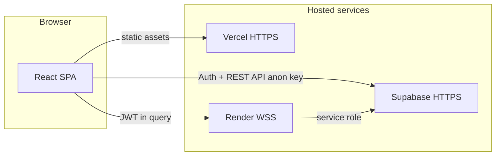

# Secure Group Chat — CNS Lab (Experiment 11)

A full-stack **secure group chat** web app for **BCSE309P — Cryptography and Network Security**. It demonstrates **TLS in practice** (HTTPS for the SPA, **WSS** for real-time WebSockets), **JWT-based authorization** on the chat server, and **PostgreSQL Row Level Security (RLS)** via Supabase.

**Live demo (if deployed):**

- [Frontend (Vercel)](https://cns-lab-assignment-11-mishti-mattu.vercel.app/)
- [WebSocket backend (Render)](https://cns-lab-assignment-11.onrender.com/)
- [Source repository](https://github.com/mishtimattu21/CNS-Lab-Assignment-11)

---

## What this project demonstrates

| Topic | How it appears here |
|--------|----------------------|
| **Transport security** | Browser loads the app over **HTTPS**; chat uses **WSS** (`wss://`) so messages are encrypted in transit. |
| **Authentication** | Supabase **email/password** auth; sessions include a **JWT** (`access_token`). |
| **Authorization** | The Node WebSocket server **validates the JWT** before accepting a connection; **group membership** is checked before joining a room. |
| **Database access control** | Supabase **RLS** limits what each user can read/write; **service role** is used only on the server for privileged inserts. |

**Scope:** Confidentiality and integrity apply to the **TLS path** (browser ↔ platform). **End-to-end encryption** between clients (server never sees plaintext) is **not** implemented; the lab focuses on TLS, JWT, and RLS.

---

## Architecture



- **React (Vite)** — Login, registration, username setup, dashboard, group chat UI.
- **Supabase** — Auth, PostgreSQL, RLS policies; client uses the **publishable (anon) key**.
- **Node.js WebSocket server** — Validates JWT, verifies membership, persists/broadcasts messages using the **service role** key (never exposed to the browser).

---

## Tech stack

| Layer | Technologies |
|--------|----------------|
| Frontend | React 18, TypeScript, Vite, Tailwind CSS, shadcn/ui-style components, React Router |
| Real-time | `ws` (WebSockets), JWT in query string |
| Backend | Node.js, TypeScript, `@supabase/supabase-js` |
| Data & auth | Supabase (PostgreSQL, Auth, RLS) |

---

## Prerequisites

- **Node.js** (LTS recommended) and **npm**
- A **Supabase** project (free tier is fine)
- For local WSS: ability to trust a **self-signed certificate** in the browser (one-time prompt)

---

## Supabase setup

1. Create a project in the [Supabase Dashboard](https://supabase.com/dashboard).
2. Open **SQL Editor**, run the bundled script in order:
   - `supabase/FULL_SETUP_NEW_PROJECT.sql`  
   (Creates `profiles`, `groups`, `group_members`, `messages`, triggers, and RLS policies.)
3. **Authentication → Providers → Email** — enable as needed.
4. **Project Settings → API** — copy:
   - **Project URL**
   - **anon / public** key → frontend env as `VITE_SUPABASE_PUBLISHABLE_KEY`
   - **service_role** key → **server only** as `SUPABASE_SERVICE_ROLE_KEY` (never commit, never ship to the client)

Optional migrations under `supabase/migrations/` may apply further policy tweaks; use them if your project was created from the full setup script first.

---

## Environment variables

### Project root (`.env`) — Vite frontend

| Variable | Description |
|----------|-------------|
| `VITE_SUPABASE_URL` | Supabase project URL |
| `VITE_SUPABASE_PUBLISHABLE_KEY` | Supabase anon/public key (safe in the browser) |
| `VITE_WS_URL` | WebSocket base URL, e.g. `wss://localhost:3001` locally or `wss://your-app.onrender.com` in production |

Vite only exposes variables prefixed with `VITE_`.

### Server (`server/.env` or root `.env`) — WebSocket process

| Variable | Description |
|----------|-------------|
| `SUPABASE_URL` | Same project URL (or use `VITE_SUPABASE_URL` from root `.env`) |
| `SUPABASE_SERVICE_ROLE_KEY` | **Secret** — server-side DB access |
| `SUPABASE_ANON_KEY` or `VITE_SUPABASE_PUBLISHABLE_KEY` | Used for JWT validation via `auth.getUser`; prefer the anon key here |
| `PORT` | Listen port (default **3001**) |
| `SSL_KEY_PATH` / `SSL_CERT_PATH` | Custom TLS files for local HTTPS (defaults under `server/certs/`) |
| `USE_HTTP` / Render env | On platforms that terminate TLS (e.g. Render), HTTP behind the proxy is used automatically |

---

## Local development

### 1. Install dependencies

```bash
npm install
npm install --prefix server
```

### 2. Configure environment

Create a **root** `.env` with `VITE_SUPABASE_*` and `VITE_WS_URL` as above.  
Add `SUPABASE_SERVICE_ROLE_KEY` (and optionally duplicate Supabase URL keys) in **root** or **`server/.env`** so the WebSocket server can start.

### 3. TLS certificates for local WSS

The server serves **HTTPS** locally and upgrades to **WSS**. Generate dev certs:

```bash
npm run generate-certs
```

This writes `server.key` and `server.crt` into `server/certs/`. Visit `https://localhost:3001` once and accept the certificate warning so the browser allows `wss://localhost:3001` from the SPA.

### 4. Run the app

**Frontend and WebSocket together:**

```bash
npm run dev:all
```

**Or separately:**

```bash
npm run dev          # Vite dev server (frontend)
npm run dev:server   # WebSocket server on PORT (default 3001)
```

Set `VITE_WS_URL=wss://localhost:3001` in `.env` for local chat.

---

## npm scripts

| Script | Purpose |
|--------|---------|
| `npm run dev` | Vite dev server |
| `npm run dev:server` | WebSocket server (watch mode) |
| `npm run dev:all` | Frontend + server via `concurrently` |
| `npm run build` | Production build of the SPA |
| `npm run generate-certs` | Generate self-signed certs in `server/certs/` |
| `npm run test` | Vitest unit tests |
| `npm run lint` | ESLint |

The WebSocket server has its own scripts (`build`, `start`) under `server/` — see [`server/README.md`](server/README.md) for details on TLS modes and production.

---

## Production deployment

- **Frontend:** Build static assets (`npm run build`) and host on a platform that serves **HTTPS** (e.g. Vercel). Set `VITE_*` env vars in the host dashboard.
- **WebSocket:** Deploy the Node server to a host that provides **TLS** at the edge (e.g. Render). Set `SUPABASE_*` and `PORT`; the server detects reverse-proxy TLS and listens on HTTP internally when appropriate.
- Point `VITE_WS_URL` at the deployed **`wss://`** WebSocket URL.

---

## Security notes

- **Never** commit `.env`, `server/.env`, or the **service role** key. The repo should only contain **publishable** Supabase keys in client-side config examples.
- JWT is passed as a **query parameter** on the WebSocket URL; in production, always use **WSS** so it is not sent in clear text.
- For coursework, the LaTeX report `Mishti_Mattu_BCSE309P_CNS_Experiment_11.tex` (in this repo) documents screenshots, architecture, and submission links.

---

## Lab report

The written experiment (aim, theory, architecture, deployment table) is maintained in **`Mishti_Mattu_BCSE309P_CNS_Experiment_11.tex`**. Compile with `pdflatex` (twice if cross-references are used). Place screenshot PNGs under `figures/` as described in that document.

---

## Author

**Mishti Mattu** — BCSE309P (VIT Chennai).  
Experiment 11: Secure group chat using SSL/TLS (HTTPS & WSS) and authenticated sessions.
